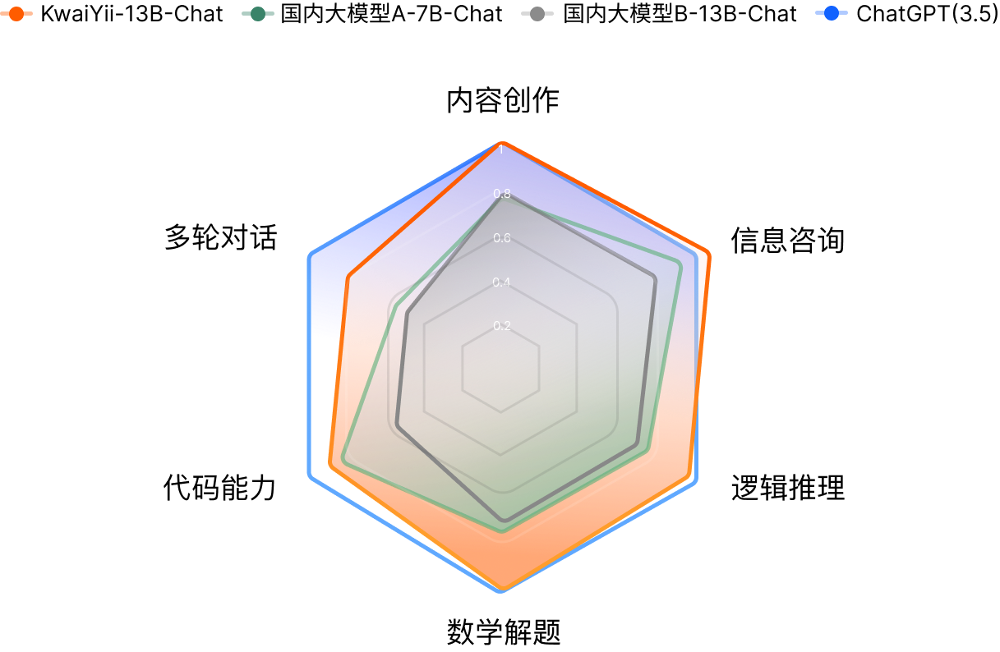

# 「快意」大规模语言模型（KwaiYii）

## 简介
「快意」大模型（KwaiYii） 是由快手AI团队从零到一独立自主研发的一系列大规模语言模型（Large Language Model，LLM），当前包含了多种参数规模的模型，并覆盖了预训练模型（KwaiYii-Base)、对话模型（KwaiYii-Chat)。这里面我们介绍13B规模的系列模型KwaiYii-13B，其主要特点包括：
- KwaiYii-13B-Base预训练模型具备优异的通用技术底座能力，在绝大部分权威的中/英文Benchmark上取得了同等模型尺寸下的State-Of-The-Art效果。例如，KwaiYii-13B-Base预训练模型在MMLU、CMMLU、C-Eval、HumanEval等Benchmark上目前处于同等模型规模的领先水平。
- KwaiYii-13B-Chat对话模型具备出色的语言理解和生成能力，支持内容创作、信息咨询、数学逻辑、代码编写、多轮对话等广泛任务，人工评估结果表明KwaiYii-13B-Chat超过主流的开源模型，并在内容创作、信息咨询和数学解题上接近ChatGPT(3.5)同等水平。

## Benchmark评测效果
我们选取了行业中被广泛认可的权威Benchmark进行评测，例如体现英文综合能力的MMLU、体现中文综合能力的C-Eval和CMMLU、体现中小学数学能力的GSM8K以及体现代码能力的HumanEval，并与行业上的主流模型在上述Benchmark上汇报的指标结果进行比较。具体对比结果如下所示：

- [C-Eval](https://cevalbenchmark.com/index.html)是一个全面的中文基础模型评测数据集，由清华大学、上海交通大学和爱丁堡大学合作构建，包含12342道单项选择题，涵盖数学、物理、化学、生物、历史、政治、计算机等52个不同学科和四个难度级别，是最具影响力的中文综合性考试评测集之一。其采用5-shot的方式进行评测。

<table class="tg">
<thead>
  <tr>
    <th class="tg-0lax"></th>
    <th class="tg-b6h1">Model 5-shot</th>
    <th class="tg-d5y0">Average</th>
    <th class="tg-b6h1">STEM</th>
    <th class="tg-b6h1">Social   Sciences</th>
    <th class="tg-b6h1">Humanities</th>
    <th class="tg-b6h1">Others</th>
  </tr>
</thead>
<tbody>
  <tr>
    <td class="tg-y0ns" rowspan="4">预训练模型</td>
    <td class="tg-khs9"><strong>KwaiYii-13B-Base</strong></td>
    <td class="tg-xi0c"><strong>62.6</strong></td>
    <td class="tg-xi0c"><strong>52.7</strong></td>
    <td class="tg-xi0c"><strong>74.1</strong></td>
    <td class="tg-xi0c"><strong>68.8</strong></td>
    <td class="tg-xi0c"><strong>63.7</strong></td>
  </tr>
  <tr>
    <td class="tg-y0ns">ChatGLM2-12B-Base</td>
    <td class="tg-d5y0">61.6</td>
    <td class="tg-d5y0">55.4</td>
    <td class="tg-d5y0">73.7</td>
    <td class="tg-d5y0">64.2</td>
    <td class="tg-d5y0">59.4</td>
  </tr>
  <tr>
    <td class="tg-y0ns">Qwen-7B</td>
    <td class="tg-b6h1">59.6</td>
    <td class="tg-b6h1">52.8</td>
    <td class="tg-b6h1">74.1</td>
    <td class="tg-b6h1">63.1</td>
    <td class="tg-b6h1">55.2</td>
  </tr>
  <tr>
    <td class="tg-y0ns">Baichuan-13B-Base</td>
    <td class="tg-b6h1">53.6</td>
    <td class="tg-b6h1">47</td>
    <td class="tg-b6h1">66.8</td>
    <td class="tg-b6h1">57.3</td>
    <td class="tg-b6h1">49.8</td>
  </tr>
  <tr>
    <td class="tg-y0ns" rowspan="6">对话模型</td>
    <td class="tg-y0ns">ChatGLM2</td>
    <td class="tg-b6h1">71.1</td>
    <td class="tg-b6h1">64.4</td>
    <td class="tg-b6h1">81.6</td>
    <td class="tg-b6h1">73.7</td>
    <td class="tg-b6h1">71.3</td>
  </tr>
  <tr>
    <td class="tg-y0ns">GPT-4</td>
    <td class="tg-b6h1">68.7</td>
    <td class="tg-b6h1">67.1</td>
    <td class="tg-b6h1">77.6</td>
    <td class="tg-b6h1">64.5</td>
    <td class="tg-b6h1">67.8</td>
  </tr>
  <tr>
    <td class="tg-khs9"><strong>KwaiYii-13B-Chat</strong></td>
    <td class="tg-8jfr"><strong>59.0</strong></td>
    <td class="tg-xi0c"><strong>49.9</strong></td>
    <td class="tg-xi0c"><strong>69.2</strong></td>
    <td class="tg-xi0c"><strong>63.9</strong></td>
    <td class="tg-xi0c"><strong>61.0</strong></td>
  </tr>
  <tr>
    <td class="tg-y0ns">ChatGLM2-12B-Chat</td>
    <td class="tg-d5y0">57.0</td>
    <td class="tg-d5y0">52.1</td>
    <td class="tg-d5y0">69.3</td>
    <td class="tg-d5y0">58.5</td>
    <td class="tg-d5y0">53.2</td>
  </tr>
  <tr>
    <td class="tg-y0ns">GPT-3.5</td>
    <td class="tg-d5y0">54.4</td>
    <td class="tg-b6h1">52.9</td>
    <td class="tg-b6h1">61.8</td>
    <td class="tg-b6h1">50.9</td>
    <td class="tg-b6h1">53.6</td>
  </tr>
  <tr>
    <td class="tg-y0ns">Baichuan-13B-Chat</td>
    <td class="tg-d5y0">51.5</td>
    <td class="tg-d5y0">43.7</td>
    <td class="tg-d5y0">64.6</td>
    <td class="tg-d5y0">56.2</td>
    <td class="tg-d5y0">49.2</td>
  </tr>
</tbody>
</table>

- [MMLU](https://github.com/hendrycks/test)由加州大学伯克利分校等知名高校共同打造，集合了科学、工程、数学、人文、社会科学等领域的57个科目，包含14079道单项选择题，主要目标是对模型的英文跨学科专业能力进行深入测试。其内容广泛，从初级水平一直涵盖到高级专业水平，同样采用5-shot方式进行评测。

<table class="tg">
<thead>
  <tr>
    <th class="tg-0lax"></th>
    <th class="tg-d5y0">Model 5-shot</th>
    <th class="tg-d5y0">Average</th>
    <th class="tg-d5y0">STEM</th>
    <th class="tg-d5y0">Social   Sciences</th>
    <th class="tg-d5y0">Humanities</th>
    <th class="tg-d5y0">Others</th>
  </tr>
</thead>
<tbody>
  <tr>
    <td class="tg-0lax" rowspan="7">  预训练模型</td>
    <td class="tg-y0ns">Llama2-70B-Base</td>
    <td class="tg-y0ns">68.9</td>
    <td class="tg-3oft">-</td>
    <td class="tg-3oft">-</td>
    <td class="tg-3oft">-</td>
    <td class="tg-3oft">-</td>
  </tr>
  <tr>
    <td class="tg-khs9"><strong>KwaiYii-13B</td>
    <td class="tg-khs9"><strong>57.42</td>
    <td class="tg-z1xk"><strong>46.82</td>
    <td class="tg-z1xk"><strong>68.83</td>
    <td class="tg-z1xk"><strong>51.56</td>
    <td class="tg-z1xk"><strong>64.96</td>
  </tr>
  <tr>
    <td class="tg-d5y0">Qwen-7B</td>
    <td class="tg-y0ns">56.7</td>
    <td class="tg-y0ns">-</td>
    <td class="tg-y0ns">-</td>
    <td class="tg-y0ns">-</td>
    <td class="tg-y0ns">-</td>
  </tr>
  <tr>
    <td class="tg-y0ns">ChatGLM2-12B-Base</td>
    <td class="tg-y0ns">56.18</td>
    <td class="tg-y0ns">48.18</td>
    <td class="tg-y0ns">65.13</td>
    <td class="tg-y0ns">52.58</td>
    <td class="tg-y0ns">60.93</td>
  </tr>
  <tr>
    <td class="tg-y0ns">Llama2-13B-Base</td>
    <td class="tg-y0ns">54.8</td>
    <td class="tg-y0ns">-</td>
    <td class="tg-y0ns">-</td>
    <td class="tg-y0ns">-</td>
    <td class="tg-y0ns">-</td>
  </tr>
  <tr>
    <td class="tg-d5y0">Baichuan-13B-Base</td>
    <td class="tg-y0ns">51.6</td>
    <td class="tg-y0ns">41.6</td>
    <td class="tg-y0ns">60.9</td>
    <td class="tg-y0ns">47.4</td>
    <td class="tg-y0ns">58.5</td>
  </tr>
  <tr>
    <td class="tg-y0ns">Llama1-13B-Base</td>
    <td class="tg-y0ns">46.9</td>
    <td class="tg-y0ns">-</td>
    <td class="tg-y0ns">-</td>
    <td class="tg-y0ns">-</td>
    <td class="tg-y0ns">-</td>
  </tr>
  <tr>
    <td class="tg-0lax" rowspan="5">  对话模型</td>
    <td class="tg-y0ns">GPT-4</td>
    <td class="tg-y0ns">86.4</td>
    <td class="tg-y0ns">-</td>
    <td class="tg-y0ns">-</td>
    <td class="tg-y0ns">-</td>
    <td class="tg-y0ns">-</td>
  </tr>
  <tr>
    <td class="tg-y0ns">GPT-3.5</td>
    <td class="tg-y0ns">70.0</td>
    <td class="tg-y0ns">-</td>
    <td class="tg-y0ns">-</td>
    <td class="tg-y0ns">-</td>
    <td class="tg-y0ns">-</td>
  </tr>
  <tr>
    <td class="tg-khs9"><strong>KwaiYii-13B-Chat</strong></td>
    <td class="tg-khs9"><strong>56.44</strong></td>
    <td class="tg-khs9"><strong>46.79</strong></td>
    <td class="tg-khs9"><strong>66.36</strong></td>
    <td class="tg-khs9"><strong>50.73</strong></td>
    <td class="tg-khs9"><strong>64.28</strong></td>
  </tr>
  <tr>
    <td class="tg-d5y0">ChatGLM2-12B-Chat</td>
    <td class="tg-y0ns">52.13</td>
    <td class="tg-y0ns">47.00</td>
    <td class="tg-y0ns">61.00</td>
    <td class="tg-y0ns">46.10</td>
    <td class="tg-y0ns">56.05</td>
  </tr>
  <tr>
    <td class="tg-d5y0">Baichuan-13B-Chat</td>
    <td class="tg-y0ns">52.1</td>
    <td class="tg-y0ns">40.9</td>
    <td class="tg-y0ns">60.9</td>
    <td class="tg-y0ns">48.8</td>
    <td class="tg-y0ns">59.0</td>
  </tr>
</tbody>
</table>

- [CMMLU](https://github.com/haonan-li/CMMLU)是一个综合性的中文评估基准，专门用于评估语言模型在中文语境下的知识和推理能力。CMMLU涵盖了从基础学科到高级专业水平的67个主题，包括：需要计算和推理的自然科学，需要知识的人文科学和社会科学，以及需要生活常识的中国驾驶规则等，共11582道单项选择题。此外，CMMLU中的许多任务具有中国特色，可能在其他地区或语言中并不普遍适用，是一个完全中国化的中文测试基准。评测分别采用5-shot和0-shot的方式进行。

<table class="tg">
<thead>
  <tr>
    <th class="tg-0lax"></th>
    <th class="tg-d5y0">模型</th>
    <th class="tg-d5y0">平均分</th>
    <th class="tg-d5y0">STEM</th>
    <th class="tg-d5y0">人文学科</th>
    <th class="tg-d5y0">社会科学</th>
    <th class="tg-d5y0">其他</th>
    <th class="tg-d5y0">中国特定 主题</th>
  </tr>
</thead>
<tbody>
  <tr>
    <td class="tg-0lax"> </td>
    <td class="tg-d5y0" colspan="7">                              5-shot</td>
  </tr>
  <tr>
    <td class="tg-0lax" rowspan="6"> 预训练模型</td>
    <td class="tg-8jfr"><strong>KwaiYii-13B-Base</strong></td>
    <td class="tg-8jfr"><strong>61.73</strong></td>
    <td class="tg-8jfr"><strong>46.54</strong></td>
    <td class="tg-8jfr"><strong>69.22</strong></td>
    <td class="tg-8jfr"><strong>64.49</strong></td>
    <td class="tg-8jfr"><strong>65.09</strong></td>
    <td class="tg-8jfr"><strong>63.1</strong></td>
  </tr>
  <tr>
    <td class="tg-d5y0">Qwen-7B-Base</td>
    <td class="tg-d5y0">58.66</td>
    <td class="tg-d5y0">48.39</td>
    <td class="tg-d5y0">63.77</td>
    <td class="tg-d5y0">61.22</td>
    <td class="tg-d5y0">62.14</td>
    <td class="tg-d5y0">58.73</td>
  </tr>
  <tr>
    <td class="tg-d5y0">MiLM-6B</td>
    <td class="tg-d5y0">57.17</td>
    <td class="tg-d5y0">46.85</td>
    <td class="tg-d5y0">61.12</td>
    <td class="tg-d5y0">61.68</td>
    <td class="tg-d5y0">58.84</td>
    <td class="tg-d5y0">59.39</td>
  </tr>
  <tr>
    <td class="tg-d5y0">Baichuan-13B-Base</td>
    <td class="tg-y0ns">55.82</td>
    <td class="tg-d5y0">42.38</td>
    <td class="tg-d5y0">61.61</td>
    <td class="tg-d5y0">60.44</td>
    <td class="tg-d5y0">59.26</td>
    <td class="tg-d5y0">56.62</td>
  </tr>
  <tr>
    <td class="tg-d5y0">ChatGLM2-6B-Base</td>
    <td class="tg-y0ns">48.80</td>
    <td class="tg-d5y0">42.55</td>
    <td class="tg-d5y0">50.98</td>
    <td class="tg-d5y0">50.99</td>
    <td class="tg-d5y0">50.80</td>
    <td class="tg-d5y0">48.37</td>
  </tr>
  <tr>
    <td class="tg-y0ns">Llama1-65B-Base</td>
    <td class="tg-d5y0">39.80</td>
    <td class="tg-d5y0">34.47</td>
    <td class="tg-d5y0">40.24</td>
    <td class="tg-d5y0">41.55</td>
    <td class="tg-d5y0">42.88</td>
    <td class="tg-d5y0">37.00</td>
  </tr>
  <tr>
    <td class="tg-y0ns" rowspan="4">对话模型</td>
    <td class="tg-d5y0">GPT-4</td>
    <td class="tg-k0nr">70.95</td>
    <td class="tg-d5y0">65.23</td>
    <td class="tg-d5y0">72.11</td>
    <td class="tg-d5y0">72.06</td>
    <td class="tg-d5y0">74.79</td>
    <td class="tg-d5y0">66.12</td>
  </tr>
  <tr>
    <td class="tg-8jfr"><strong>KwaiYii-13B-Chat</strong></td>
    <td class="tg-8jfr"><strong>59.97</strong></td>
    <td class="tg-8jfr"><strong>47.33</strong></td>
    <td class="tg-8jfr"><strong>65.85</strong></td>
    <td class="tg-8jfr"><strong>62.19</strong></td>
    <td class="tg-8jfr"><strong>62.23</strong></td>
    <td class="tg-8jfr"><strong>61.00</strong></td>
  </tr>
  <tr>
    <td class="tg-d5y0">Baichuan-13B-Chat</td>
    <td class="tg-d5y0">55.8</td>
    <td class="tg-d5y0">42.8</td>
    <td class="tg-d5y0">62.6</td>
    <td class="tg-d5y0">59.7</td>
    <td class="tg-d5y0">59.0</td>
    <td class="tg-d5y0">56.1</td>
  </tr>
  <tr>
    <td class="tg-d5y0">GPT-3.5</td>
    <td class="tg-d5y0">55.51</td>
    <td class="tg-d5y0">47.81</td>
    <td class="tg-d5y0">55.68</td>
    <td class="tg-d5y0">56.50</td>
    <td class="tg-d5y0">62.66</td>
    <td class="tg-d5y0">50.69</td>
  </tr>
  <tr>
    <td class="tg-0lax"> </td>
    <td class="tg-d5y0" colspan="7">                              0-shot</td>
  </tr>
  <tr>
    <td class="tg-y0ns" rowspan="5">预训练模型</td>
    <td class="tg-8jfr"><strong>KwaiYii-13B-Base</strong></td>
    <td class="tg-8jfr"><strong>61.22</strong></td>
    <td class="tg-8jfr"><strong>46.82</strong></td>
    <td class="tg-8jfr"><strong>69.35</strong></td>
    <td class="tg-8jfr"><strong>63.42</strong></td>
    <td class="tg-8jfr"><strong>64.02</strong></td>
    <td class="tg-8jfr"><strong>63.26</strong></td>
  </tr>
  <tr>
    <td class="tg-d5y0">MiLM-6B</td>
    <td class="tg-d5y0">60.37</td>
    <td class="tg-d5y0">48.88</td>
    <td class="tg-d5y0">63.49</td>
    <td class="tg-d5y0">66.20</td>
    <td class="tg-d5y0">62.14</td>
    <td class="tg-d5y0">62.07</td>
  </tr>
  <tr>
    <td class="tg-d5y0">Qwen-7B-Base</td>
    <td class="tg-d5y0">57.57</td>
    <td class="tg-d5y0">46.33</td>
    <td class="tg-d5y0">62.54</td>
    <td class="tg-d5y0">60.48</td>
    <td class="tg-d5y0">61.72</td>
    <td class="tg-d5y0">58.77</td>
  </tr>
  <tr>
    <td class="tg-d5y0">Baichuan-13B-Base</td>
    <td class="tg-y0ns">54.63</td>
    <td class="tg-d5y0">42.04</td>
    <td class="tg-d5y0">60.49</td>
    <td class="tg-d5y0">59.55</td>
    <td class="tg-d5y0">56.60</td>
    <td class="tg-d5y0">55.72</td>
  </tr>
  <tr>
    <td class="tg-d5y0">ChatGLM2-6B-Base</td>
    <td class="tg-y0ns">49.95</td>
    <td class="tg-d5y0">41.28</td>
    <td class="tg-d5y0">52.85</td>
    <td class="tg-d5y0">53.37</td>
    <td class="tg-d5y0">52.24</td>
    <td class="tg-d5y0">50.58</td>
  </tr>
  <tr>
    <td class="tg-y0ns" rowspan="3">对话模型</td>
    <td class="tg-d5y0">GPT-4</td>
    <td class="tg-k0nr">68.90</td>
    <td class="tg-d5y0">63.16</td>
    <td class="tg-d5y0">69.19</td>
    <td class="tg-d5y0">70.26</td>
    <td class="tg-d5y0">73.16</td>
    <td class="tg-d5y0">63.47</td>
  </tr>
  <tr>
    <td class="tg-8jfr"><strong>KwaiYii-13B-Chat</strong></td>
    <td class="tg-8jfr"><strong>60.41</strong></td>
    <td class="tg-8jfr"><strong>46.15</strong></td>
    <td class="tg-8jfr"><strong>66.49</strong></td>
    <td class="tg-8jfr"><strong>63.25</strong></td>
    <td class="tg-8jfr"><strong>62.68</strong></td>
    <td class="tg-8jfr"><strong>61.94</strong></td>
  </tr>
  <tr>
    <td class="tg-d5y0">GPT-3.5</td>
    <td class="tg-y0ns">53.22</td>
    <td class="tg-d5y0">44.80</td>
    <td class="tg-d5y0">53.61</td>
    <td class="tg-d5y0">54.22</td>
    <td class="tg-d5y0">59.95</td>
    <td class="tg-d5y0">49.74</td>
  </tr>
</tbody>
</table>

- [GSM8K](https://github.com/openai/grade-school-math)是由OpenAI构建的高中数学应用题数据集，包含8500道高质量的数据，主要目标是对模型的数学推理能力进行评测，其中测试集1319条数据，每个问题都需要2-8个步骤来解决，解决方案主要包括使用基本算术运算（+ − × ÷）进行一系列的基本计算，以得到最终答案。其采用8-shot进行评测。

<table class="tg">
<thead>
  <tr>
    <th class="tg-0lax"></th>
    <th class="tg-y0ns">模型</th>
    <th class="tg-y0ns">GSM8K</th>
  </tr>
</thead>
<tbody>
  <tr>
    <td class="tg-y0ns" rowspan="5">预训练模型</td>
    <td class="tg-y0ns">Qwen-7B-Base</td>
    <td class="tg-y0ns">51.6</td>
  </tr>
  <tr>
    <td class="tg-khs9"><strong>KwaiYii-13B-Base</strong></td>
    <td class="tg-khs9"><strong>48.4</strong></td>
  </tr>
  <tr>
    <td class="tg-y0ns">ChatGLM2-12B-Base</td>
    <td class="tg-y0ns">40.94</td>
  </tr>
  <tr>
    <td class="tg-y0ns">Llama2-13B-Base</td>
    <td class="tg-y0ns">28.7</td>
  </tr>
  <tr>
    <td class="tg-y0ns">Baichuan-13B-Base</td>
    <td class="tg-y0ns">22.44</td>
  </tr>
  <tr>
    <td class="tg-0lax" rowspan="5">  对话模型</td>
    <td class="tg-y0ns">GPT-4</td>
    <td class="tg-y0ns">92.0</td>
  </tr>
  <tr>
    <td class="tg-y0ns">GPT-3.5</td>
    <td class="tg-y0ns">57.1</td>
  </tr>
  <tr>
    <td class="tg-khs9"><strong>KwaiYii-13B-Chat</strong></td>
    <td class="tg-khs9"><strong>52.2</strong></td>
  </tr>
  <tr>
    <td class="tg-y0ns">Qwen-7B-Chat</td>
    <td class="tg-y0ns">43.5</td>
  </tr>
  <tr>
    <td class="tg-y0ns">ChatGLM2-12B-Chat</td>
    <td class="tg-y0ns">38.13</td>
  </tr>
</tbody>
</table>

- [HumanEval](https://github.com/openai/human-eval)是OpenAI和Anthropic AI一起制作的代码数据集，包含164个原创编程题，涉及语言理解、算法、数学和软件面试几种类型的题目。其采用0-shot的方式进行评测。

<table class="tg">
<thead>
  <tr>
    <th class="tg-vzja"></th>
    <th class="tg-y0ns">模型</th>
    <th class="tg-y0ns">HumanEval @Pass1</th>
  </tr>
</thead>
<tbody>
  <tr>
    <td class="tg-vzja" rowspan="4">  预训练模型</td>
    <td class="tg-khs9"><strong>KwaiYii-13B-Base</strong></td>
    <td class="tg-khs9"><strong>40.8</strong></td>
  </tr>
  <tr>
    <td class="tg-y0ns">Qwen-7B-Base</td>
    <td class="tg-y0ns">24.4</td>
  </tr>
  <tr>
    <td class="tg-y0ns">Llama2-13B-Base</td>
    <td class="tg-y0ns">18.3</td>
  </tr>
  <tr>
    <td class="tg-y0ns">Llama1-13B-Base</td>
    <td class="tg-y0ns">15.8</td>
  </tr>
  <tr>
    <td class="tg-0lax" rowspan="5">  对话模型</td>
    <td class="tg-y0ns">GPT-4</td>
    <td class="tg-y0ns">67.0</td>
  </tr>
  <tr>
    <td class="tg-y0ns">GPT-3.5</td>
    <td class="tg-y0ns">48.1</td>
  </tr>
  <tr>
    <td class="tg-khs9"><strong>KwaiYii-13B-Chat</strong></td>
    <td class="tg-khs9"><strong>43.3</strong></td>
  </tr>
  <tr>
    <td class="tg-y0ns">Qwen-7B-Chat</td>
    <td class="tg-y0ns">24.4</td>
  </tr>
  <tr>
    <td class="tg-y0ns">Llama2-13B-Chat</td>
    <td class="tg-y0ns">15.85</td>
  </tr>
</tbody>
</table>

从对比结果可以看出，KwaiYii-13B-Base及KwaiYii-13B-Chat模型在**各榜单中均处于领先水平**。在MMLU、CMMLU、C-Eval等体现综合学科类的Benchmark上领先，说明KwiiYii-13B-Base预训练模型在中英文双语学科和行业领域的知识能力突出。在GSM8K数学评测集上及HumanEval编程测评集上的优异表现，则体现了模型较好的数理逻辑及代码能力。

##  人工评测结果
Benchmark指标体现了语言模型的基础理解能力，更直观地，我们人工评估了模型在各类任务上遵循用户指令的能力。我们构建了一个高质量评测集，包含了内容创作、信息咨询、数学解题、逻辑推理、代码能力和多轮对话共6个类别。其中内容创作包括文章写作、翻译、摘要总结等根据给定约束生成文本的任务，以及对实体/事件的观点描述等；信息咨询偏向信息获取，如知识/常识咨询，景点、电影和音乐推荐等；数学解题主要包含四则运算、应用题、方程等数学问题；逻辑推理主要包括事实推理、演绎推理和数据统计等；代码能力包含代码编写、代码调试、Bug分析；多轮对话则主要体现在一个Session中持续对话的上下文意图理解和产生正确回复的能力。

为了直观地比较待评测模型与ChatGPT的效果差异，对于评测集中的每个问题，我们都评测了其与ChatGPT的Good:Same:Bad（下文简称GSB，其中Good表示评测集中，待评测模型比ChatGPT表现更好的数量，Same则表示表现持平的数量，Bad则是待评测模型比ChatGPT表现更差的数量）结果。具体而言，我们将待评测模型与ChatGPT进行双盲对比测试：对于每一个Query，我们隐藏模型信息，并打乱两个模型的答案顺序，然后分配给多名评测者，评测人员根据内容正确性、内容相关性、内容详实性等维度进行打分，然后从“模型A好”、“模型B好”、“两者一样好”、“两者都一般”以及“两者一样差”五个选项中进行选择，最终再根据多名评测人员的GSB评测结果，按照规则拟合成该条数据的统一GSB结果。

我们对KwaiYii-13B-Chat模型以及同等参数规模的行业主流模型，均与ChatGPT(3.5)进行了对比和人工评估，其各自的得分如下图所示。从人工评估的结果来看，KwaiYii-13B-Chat超过了同等规模的开源模型，并接近ChatGPT同等水平。在内容创作、信息咨询、逻辑推理和数学解题上，基本与ChatGPT(3.5)效果相当。在多轮对话能力方面，KwaiYii-13B-Chat超过同等规模的开源模型，但与ChatGPT(3.5)仍有一定差距。注意：人工评估结果受到评测数据覆盖面、标注主观性等因素的影响，无法全面反映大语言模型的所有能力。
               
				            			                                                                                             

